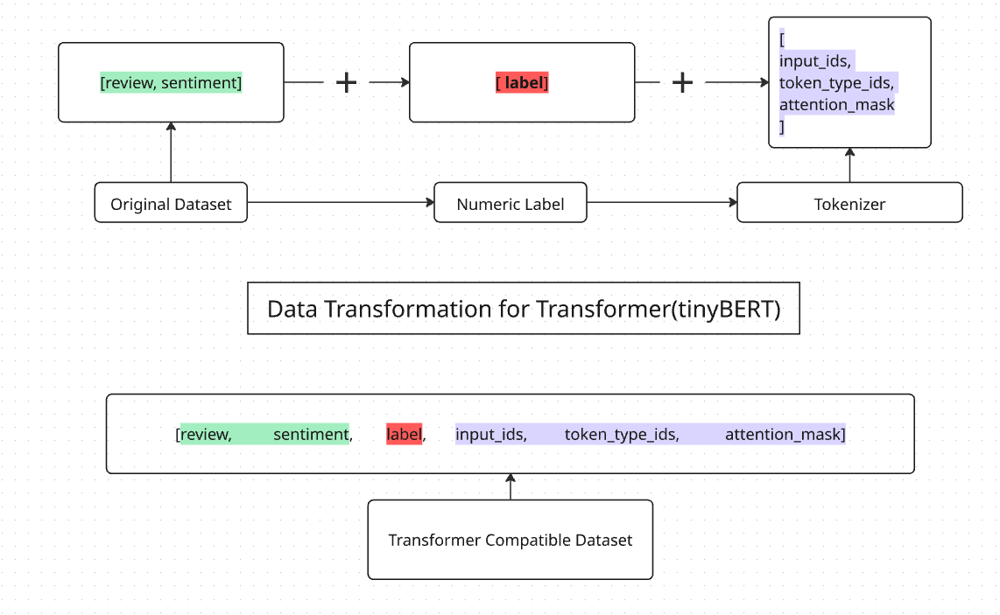

# Using Transformers for Sentiment Analysis

This document highlights **how transformers were used across different phases** of a binary sentiment analysis pipeline. The focus is on *what* was done, not extensive explanations.

---

## Transformer Model

- **Model:** `huawei-noah/TinyBERT_General_4L_312D`
- **Usage:**  
  - Data tokenization  
  - Model fine-tuning (training)

---

## Data Transformation Overview


---

## Usage 1: Data Tokenization

The transformer tokenizer was used to process the `review` text column and prepare the dataset for training and evaluation.

```python
def tokenize(batch):
  temp = tokenizer(batch['review'], padding=True, truncation=True, max_length=300)
  # padding will make length of all tokens equal
  return temp


dataset = dataset.map(tokenize, batched=True, batch_size=None)
```

**Purpose**
- Convert raw text into tokenized inputs required by TinyBERT
- Ensure compatibility with the transformer model

---

## Usage 2: Model Training (Fine-tuning)

The pretrained TinyBERT model was fine-tuned on the labeled sentiment dataset using Hugging Face’s `Trainer` API.

```python
Trainer(model=model)
```

**Purpose**
- Adapt a general-purpose transformer to a sentiment classification task

---


## Outcome

- Fine-tuned TinyBERT sentiment classifier
- Ready to classify new, unseen text data
- Lightweight and efficient for inference

---

